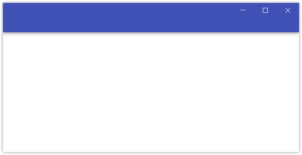
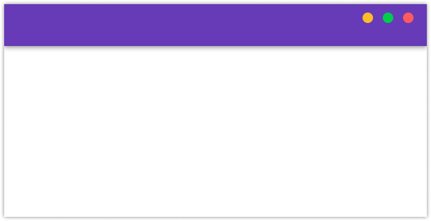

### Description

This package has made some modifications based on [custom-electron-titlebar](https://github.com/AlexTorresSk/custom-electron-titlebar). It has now become a simpler titlebar. It does not have a complete menu bar and can be placed in any of your UI layouts. It also provides Window functions: maximum, minimum, recovery.

It can also be used in the web, but the window function will no longer work.

If you need a complete titlebar, [custom-electron-titlebar](https://github.com/AlexTorresSk/custom-electron-titlebar) is for you.

### installation

```shell
yarn add electron-titlebar-react-component
or
npm i electron-titlebar-react-component
```

### use

```jsx
public\index.html

<div id="root"></div>
<script>
  if (window.process) {
    window.remote = require('electron').remote;
  }
</script>
```

```jsx
'src\App.js';

import React from 'react';
import { TitlebarWid, TitlebarMac } from 'electron-titlebar-react-component';

function App() {
  return (
    <div>
      <TitlebarWid style={{ background: '#3a3a3a' }} />
      <TitlebarMac style={{ background: '#3f51b5' }} />
    </div>
  );
}

export default App;
```

#### electron.js

```js
main.js;

const { app, BrowserWindow } = require('electron');
const path = require('path');

let mainWindow;

function createWindow() {
  mainWindow = new BrowserWindow({
    width: 800,
    height: 600,
    frame: false,
    webPreferences: {
      nodeIntegration: true
    }
  });

  // mainWindow.loadFile('index.html')
  mainWindow.loadURL('http://localhost:3000');

  mainWindow.on('closed', function() {
    mainWindow = null;
  });
}

app.on('ready', createWindow);

app.on('window-all-closed', function() {
  if (process.platform !== 'darwin') app.quit();
});

app.on('activate', function() {
  if (mainWindow === null) createWindow();
});
```

##### What the component looked like initially


##### You can put the component in any position and assemble it to your favorite, such as the following.




